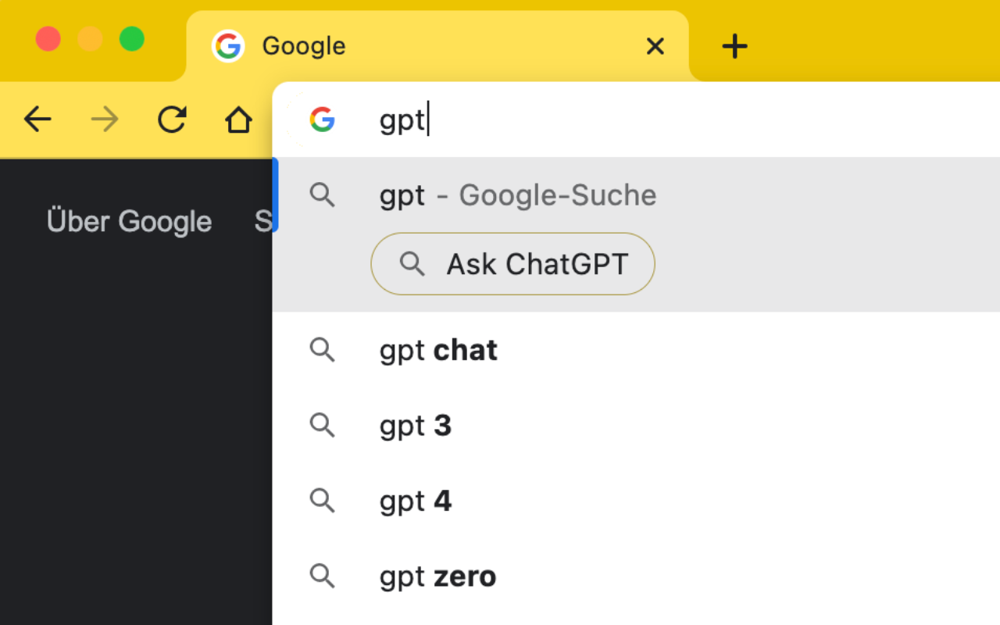
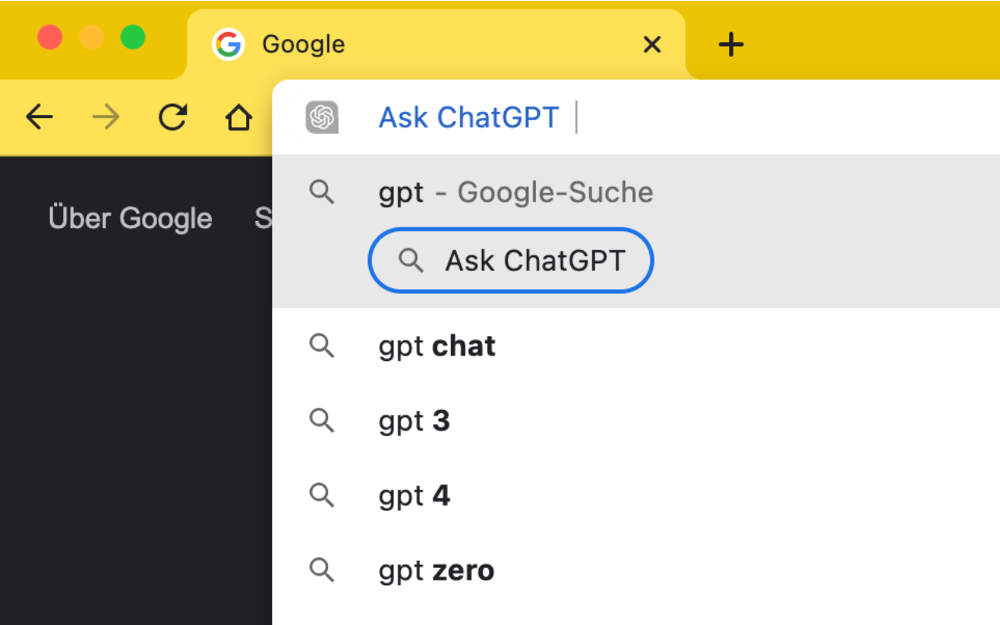
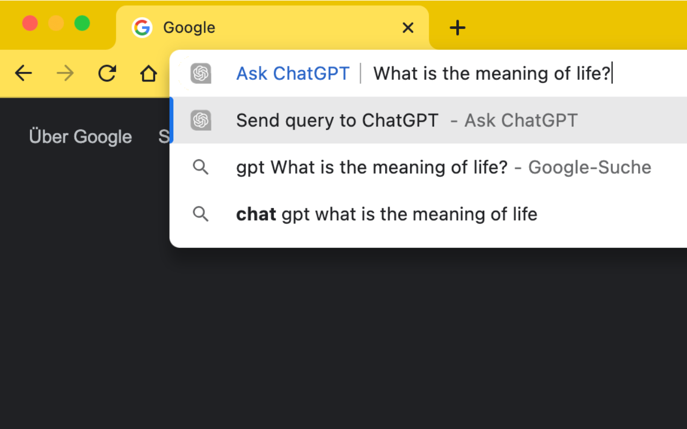
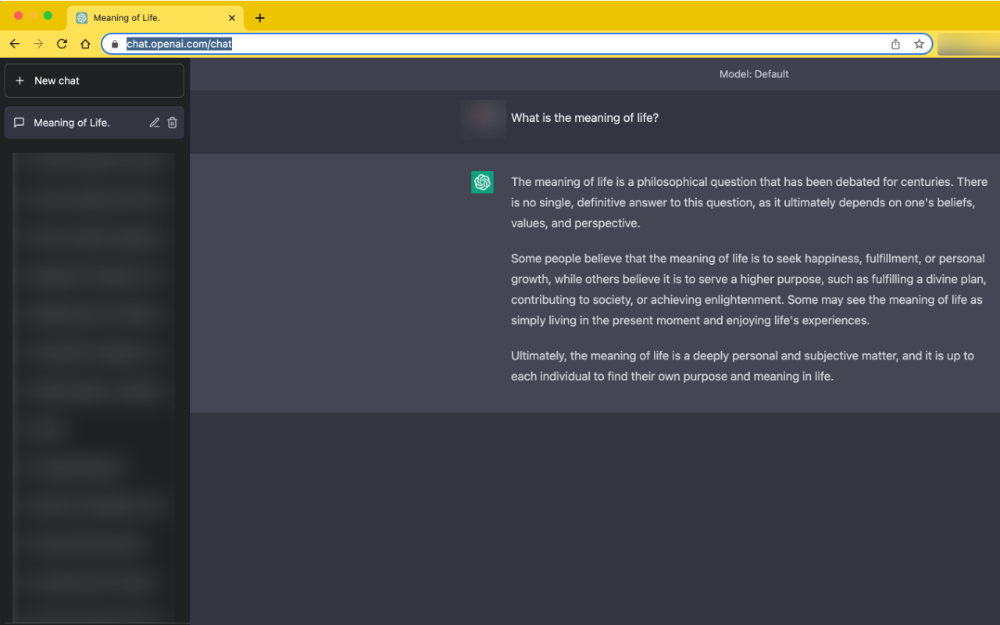

# chrome-ask-gpt

This Extension brings the power of ChatGPT right into your Chrome OmniBar!

How to use it:

1. Open a new Tab
2. Type: "gpt", followed by a space\*
   - If you already have a shortcut called gpt,
     you might need to press TAB instead of
     space to activate the extension
3. Insert any query you like and press enter
4. You will be redirected to chat.openai.com and your query will be inserted and submitted automatically!

Extra Feature:
The extension tries to detect whether you're logged into ChatGPT or not.
If you see the message

"You seem to not be logged in! Please log in at https://chat.openai.com/auth/login"

you can press enter and you'll be directly redirected to the login page!

## Screenshots

